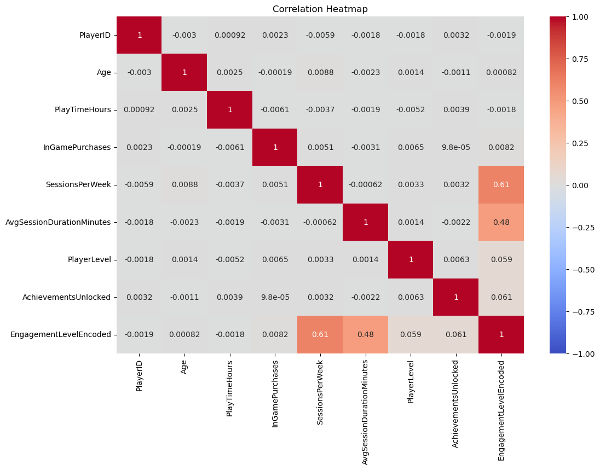

# Gamer Engagement Analysis
#### Authors: Cayke Felipe dos Anjos and James Warsing
## Overview
This project analyzes gamer engagement data to offer strategic business recommendations for a new game studio. We aim to train statistical models in order to predict the most engaging gaming genres and difficulties for game production. Gaming engagement is very correlated to profitability as more players tend to bring new players in and it also allows more people to purchase in game features or Downloadable Content (DLC), incresing the revenue. As result this project provides three business recommendations: what genres and dificulties should a future game have for a variety of gamer profiles.

## Business Problem
The company is expanding its portfolio by investing in a new game studio. Launching a new game in todays competitive entertainment industry requires a solid understanding of what drives game success and attracts audiences. The game industry is known for its substantial risks and high capital demands. Recent successes in games with high investment and higher return rate such as the incredibly difficult role playing game "Elden Ring" costing around $200 million but selling over 25 million copies and the action game "Grand Theft Auto V" which similarly costed around $265 million but is estimated to have sold almost $8 billion are certainly a good example of how successful this industry can be. However, bad investments also do exist, like the first person shooting game "Immortals of Aveum", which cost $125 million but sold only around $2 million, which caused massive layoffs on the studio.

Our project aims to analyze a gamer engagement dataset. By using data analysis techniques and statistical modelling, we seek to predict the best features that correlate with high player engagement. The goal is to provide three concrete business recommendations that maximize engagement and lower business risks, ensuring a strong entry into the market.

Questions we tried to answer with analysis:

What are the top features that correlate with gamer engagement?
How different are the audiences and their engagement choices?
What genres are most engaging for multiple audiences?

## Data Understanding and Analysis
__Source of data:__ We used the [Online Gaming Behavior Dataset](https://www.kaggle.com/datasets/rabieelkharoua/predict-online-gaming-behavior-dataset) from Kaggle. This dataset includes 40,000 rows of information such as Age, Gender, Genre, Gaming Duration, Engagement Level, and more. From this data we sought to use multiple machine learning models to predict the factors the drive high engagement levels. With this we can make recommendations that would help the company understand what to look for to make an engaging game.

### Visualizations
1. Distribution of Engagement

The barchart above shows how the engagement level is distributed, with the majority having medium engagement

2. Correlation comparing features.

As we can see from the heatmap above, engagement is mostly correlated with the sessions played per week and the average session duration

3. Comparing Engagement Level with Sessions Per Week and Average Session Duration

With these box plots we can see that the players with higher engagement levels tend to play games more often and for longer durations.

## Modeling
We used five models to try to make predictions about our target variable of engagement to find what factors were the most important.

1. Our first model was a baseline model with a score of 78% accuracy on both the train and test
2. The second model was a logistic regression model with the most correlated features, it had a 77% accuracy on the train and test
3. The third model was a decision tree classifier with a 100% accuracy on the train and 83% accuracy on the test
4. The fourth used two logistic regression models based on first split from decision tree classifier (SessionsPerWeek). It scored 88% accuracy on the train and 86% accuracy on the test.
5. The final model was a decision tree classifier with the hyperparameter tuned, it scored the best with a 92% accuracy on the train and 90% accuracy on the test.
### Evaluations
__Baseline model:__ The baseline model provides a benchmark to compare the performance of other models. It shows consistent performance on both train and test sets, indicating that more sophisticated models need to outperform this baseline to be considered effective.

__Logistic Regression Model with Correlated Features:__ This model slightly underperforms compared to the baseline. It suggests that merely using the most correlated features may not capture the complexity of the data. The consistent accuracy on train and test sets indicates no overfitting but suggests room for improvement in feature selection or model complexity.

__Decision Tree Classifier:__ The decision tree shows perfect accuracy on the training set but a significant drop in the test set, indicating overfitting. The model memorizes the training data but fails to generalize to unseen data. Pruning or tuning hyperparameters could help mitigate this overfitting.

__Combined Logistic Regression Models (Split by SessionsPerWeek):__ This approach shows a substantial improvement over the baseline and the previous logistic regression model. The strategy of splitting the data based on a feature (SessionsPerWeek) and then applying logistic regression models enhances performance, indicating that handling subpopulations differently can be beneficial.

__Hyperparameter Tuned Decision Tree Classifier:__ This model achieves the highest accuracy among all tested models, showing both high training and test accuracy, which indicates a good balance between bias and variance. Hyperparameter tuning effectively addresses the overfitting observed in the previous decision tree model, leading to better generalization.

# Conclusions

__In order to create an engaging game, we have 3 different recommendations in descending order of importance:__
- More sessions are better: players with a larger amount of sessions per week engage much more with the game than with a low number of sessions. We recommend creating special events during different days of the week (dungeons, missions, bosses) with special rewards so players keep coming back multiple times per week. Engagement can increase by 1.26 for players who come back several times per week.

  
- Balance is everything: players with very large average session duration engage poorer than gamers with low duration. In order to prevent a decline in this behavior we suggest advising the gamer to take a break to stretch after a long time (~2h) which also increases the number of sessions. Playing the game in moderate amounts per session can increase engagement by 0.7.

- Feeling of achievement and progress is important: players with higher levels and more achievements engage better. The game should be able to allow the player to level up faster initially and unlock achievements that are meaningful. This can increase the average engagement by 0.14 for higher level players and 0.1 for more achievements.

## Next Steps
We could do further and a more thorough analysis of gamer behavior with the following steps:

- Pull more datasets that have information about specific games and their cost so we can determine what games are profitable.

- Sentiment analysis from social media and gaming forums to see what games are highly played and trending among players.

- Obtain information about when games release to find the best time to release a game and when not to release a game. (e.g. Christmas/Near other big name releases)

## For More Information

For additional info, contact [Cayke Felipe dos Anjos]() or [James Warsing](www.linkedin.com/in/jameswarsing)

